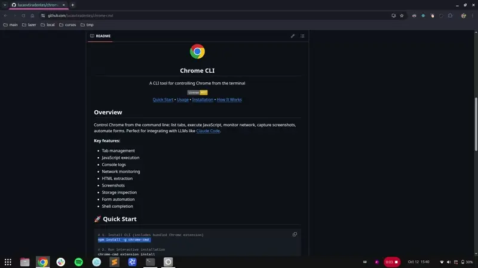

<div align="center">
<a href="https://www.google.com/chrome/" target="_blank" rel="noopener noreferrer">
  
</a>
<h2>Chrome CLI</h2>
<p>A CLI tool for controlling Chrome from the terminal</p>
<p>
  <a href="https://opensource.org/licenses/MIT"></a>
  <br>
  <a href="#rocket-quick-start">Quick Start</a> • <a href="#bulb-usage">Usage</a> • <a href="#package-installation">Installation</a> • <a href="#gear-how-it-works">How It Works</a>
</p>

</div>

## Overview

Control Chrome from the command line: list tabs, execute JavaScript, monitor network, capture screenshots, automate forms.

<div align="center">
  
</div>

## :sparkles: Features

✔️ **Tab management** - list, select, create, close, refresh, focus, and navigate between Chrome tabs from the terminal

✔️ **JavaScript execution** - run custom JavaScript code directly in any tab and get the results instantly

✔️ **Network monitoring** - capture and filter HTTP requests with headers, payloads, response bodies, and timing information

✔️ **Console logs inspection** - view color-coded console output with smart object formatting and type filtering (error, warn, info, debug)

✔️ **HTML extraction and screenshots** - extract page HTML with CSS selectors or capture full-page screenshots with a single command

✔️ **Form automation and storage access** - fill input fields, click elements, and inspect cookies, localStorage, and sessionStorage

## :rocket: Quick Start

```bash
# 1. Install CLI (includes bundled Chrome extension)
npm install -g chrome-cmd

# 2. Run interactive installation
chrome-cmd extension install
# This will guide you through:
#  - Loading the extension in Chrome
#  - Entering the extension ID
#  - Configuring native messaging

# 3. Test
chrome-cmd tabs list
```

## :bulb: Usage

All commands use the **selected tab** by default. Override with `--tab <index>` flag.

<details>
<summary><b>Tab Management</b></summary>

<!-- BEGIN:TAB_MANAGEMENT -->
```bash
# List all open Chrome tabs
chrome-cmd tabs list

# Select tab for subsequent commands
chrome-cmd tabs select 1

# Focus/activate a tab (bring to front)
chrome-cmd tabs focus
chrome-cmd tabs focus --tab 3

# Create a new tab
chrome-cmd tabs create https://google.com
chrome-cmd tabs create https://google.com --background
chrome-cmd tabs create

# Navigate tab to a specific URL
chrome-cmd tabs navigate https://github.com
chrome-cmd tabs navigate https://github.com --tab 2

# Execute JavaScript in selected tab
chrome-cmd tabs exec "document.title"
chrome-cmd tabs exec "document.images.length"
chrome-cmd tabs exec "Array.from(document.querySelectorAll('a')).map(a => a.href)"
chrome-cmd tabs exec "2 + 2"

# Close selected tab
chrome-cmd tabs close

# Reload/refresh selected tab
chrome-cmd tabs refresh

# Capture screenshot of selected tab
chrome-cmd tabs screenshot
chrome-cmd tabs screenshot --output ~/Downloads/page.png
chrome-cmd tabs screenshot --tab 2

# Extract HTML content from selected tab
chrome-cmd tabs html
chrome-cmd tabs html --selector "div.content"
chrome-cmd tabs html --raw
chrome-cmd tabs html --full

# Get console logs from selected tab
chrome-cmd tabs logs
chrome-cmd tabs logs -n 100
chrome-cmd tabs logs --error
chrome-cmd tabs logs --warn
chrome-cmd tabs logs --info --log --debug
chrome-cmd tabs logs --error --warn

# Get network requests from selected tab
chrome-cmd tabs requests
chrome-cmd tabs requests -n 100
chrome-cmd tabs requests --method GET
chrome-cmd tabs requests --method POST
chrome-cmd tabs requests --status 200
chrome-cmd tabs requests --status 404
chrome-cmd tabs requests --url "/api"
chrome-cmd tabs requests --url "google.com"
chrome-cmd tabs requests --all
chrome-cmd tabs requests --failed
chrome-cmd tabs requests --body
chrome-cmd tabs requests --headers
chrome-cmd tabs requests --method POST --status 200 --url "/api"

# Get storage data from selected tab
chrome-cmd tabs storage
chrome-cmd tabs storage --cookies
chrome-cmd tabs storage --local
chrome-cmd tabs storage --session

# Click on an element in selected tab
chrome-cmd tabs click --selector "button.submit"
chrome-cmd tabs click --text "Sign In"

# Fill an input field in selected tab
chrome-cmd tabs input --selector "#username" --value "myuser"
chrome-cmd tabs input --selector "#search" --value "query" --submit

```

<!-- END:TAB_MANAGEMENT -->

</details>

<details>
<summary><b>JavaScript Execution</b></summary>

<!-- BEGIN:JAVASCRIPT -->
```bash
# Execute JavaScript on selected tab
chrome-cmd tabs exec "document.title"
# Output: "GitHub - Chrome CLI"

# More examples
chrome-cmd tabs exec "document.images.length"
chrome-cmd tabs exec "Array.from(document.querySelectorAll('a')).map(a => a.href)"
chrome-cmd tabs exec "2 + 2"
```

<!-- END:JAVASCRIPT -->

</details>

<details>
<summary><b>Console Logs</b></summary>

<!-- BEGIN:LOGS -->
```bash
chrome-cmd tabs logs
chrome-cmd tabs logs -n 100
chrome-cmd tabs logs --error
chrome-cmd tabs logs --warn
chrome-cmd tabs logs --info --log --debug
chrome-cmd tabs logs --error --warn
```

**Features:** Color-coded output, smart object formatting, type filtering, adjustable limit

<!-- END:LOGS -->

</details>

<details>
<summary><b>Network Requests</b></summary>

<!-- BEGIN:REQUESTS -->
```bash
chrome-cmd tabs requests
chrome-cmd tabs requests -n 100
chrome-cmd tabs requests --method GET
chrome-cmd tabs requests --method POST
chrome-cmd tabs requests --status 200
chrome-cmd tabs requests --status 404
chrome-cmd tabs requests --url "/api"
chrome-cmd tabs requests --url "google.com"
chrome-cmd tabs requests --all
chrome-cmd tabs requests --failed
chrome-cmd tabs requests --body
chrome-cmd tabs requests --headers
chrome-cmd tabs requests --method POST --status 200 --url "/api"
```

**Captured data:** URL, method, status, headers, payload, response body, timing, type, errors

<!-- END:REQUESTS -->

</details>

<details>
<summary><b>HTML Extraction</b></summary>

<!-- BEGIN:HTML -->
```bash
chrome-cmd tabs html
chrome-cmd tabs html --selector "div.content"
chrome-cmd tabs html --raw
chrome-cmd tabs html --full
```

**Features:** Pretty printing, CSS selectors, token optimization, raw mode

<!-- END:HTML -->

</details>

<details>
<summary><b>Screenshots</b></summary>

<!-- BEGIN:SCREENSHOTS -->
```bash
chrome-cmd tabs screenshot
chrome-cmd tabs screenshot --output ~/Downloads/page.png
chrome-cmd tabs screenshot --tab 2
```

<!-- END:SCREENSHOTS -->

</details>

<details>
<summary><b>Storage Inspection</b></summary>

<!-- BEGIN:STORAGE -->
```bash
chrome-cmd tabs storage
chrome-cmd tabs storage --cookies
chrome-cmd tabs storage --local
chrome-cmd tabs storage --session
```

**Data includes:** Cookie flags, expiry, size, key-value pairs

<!-- END:STORAGE -->

</details>

<details>
<summary><b>Form Automation</b></summary>

<!-- BEGIN:FORM_AUTOMATION -->
```bash
chrome-cmd tabs click --selector "button.submit"
chrome-cmd tabs click --text "Sign In"
```

```bash
chrome-cmd tabs input --selector "#username" --value "myuser"
chrome-cmd tabs input --selector "#search" --value "query" --submit
```

<!-- END:FORM_AUTOMATION -->

</details>

<details>
<summary><b>System Commands</b></summary>

<!-- BEGIN:SYSTEM_COMMANDS -->
```bash
# Update to latest version
chrome-cmd update

# Shell completion (bash/zsh)
chrome-cmd completion install

chrome-cmd completion uninstall

# Extension management
chrome-cmd extension install        # Install Chrome extension (interactive setup)
chrome-cmd extension uninstall      # Uninstall Chrome extension and remove configuration
chrome-cmd extension reload         # Reload the Chrome extension

# Mediator server management
chrome-cmd mediator status
chrome-cmd mediator kill
chrome-cmd mediator restart
```

<!-- END:SYSTEM_COMMANDS -->

</details>

<details>
<summary><b>Command History</b></summary>

Click the Chrome CLI extension icon in your browser toolbar to view recent commands, execution times, and results.

</details>

## :package: Installation

**Prerequisites:** Node.js 18+, Google Chrome, Linux/macOS/Windows

<details>
<summary><b>Installation</b></summary>

**1. Install CLI globally (includes bundled Chrome extension)**

```bash
npm install -g chrome-cmd
```

**2. Run interactive installation**

```bash
chrome-cmd extension install
```

This interactive command will guide you through the complete setup:

1. **Shows the extension path** - Exact location of the bundled Chrome extension
2. **Prompts for extension ID** - After you load the extension in Chrome
3. **Configures native messaging** - Automatically sets up the host connection
4. **Validates everything** - Ensures the extension ID format is correct

The command will:
- Display the extension path for loading in Chrome
- Wait for you to enter the extension ID
- Save the extension ID to config
- Install the native messaging host
- Provide next steps for testing

**3. Test**

```bash
chrome-cmd tabs list
```

**Extension Management Commands:**

```bash
chrome-cmd extension reload     # Reload extension in Chrome
chrome-cmd extension install    # Interactive installation (recommended)
chrome-cmd extension uninstall  # Remove extension config and native host
```

</details>

<details>
<summary><b>Uninstallation</b></summary>

To completely remove chrome-cmd, run these commands in order:

```bash
# 1. Remove shell completions (if installed)
chrome-cmd completion uninstall

# 2. Remove extension configuration and native host
chrome-cmd extension uninstall

# 3. Uninstall the CLI package
npm uninstall -g chrome-cmd

# 4. Manually remove the Chrome extension
# Open chrome://extensions/ and click "Remove" on the Chrome CLI extension
```

**Note:** Due to npm limitations, cleanup commands must be run manually before uninstalling.

</details>

<details>
<summary><b>Development setup</b></summary>

For local development:

```bash
# Clone repository
git clone https://github.com/lucasvtiradentes/chrome-cmd.git
cd chrome-cmd

# Build CLI
cd packages/cli
npm install
npm run build

# Use with npm run dev
npm run dev -- tabs list
```

Load extension from `packages/chrome-extension/` directory.

</details>

## :gear: How It Works

```
CLI (terminal)
    ↓ HTTP
Mediator Server (localhost:8765)
    ↓ Native Messaging (stdio)
Chrome Extension (Service Worker)
    ↓ chrome.debugger API
Chrome Tabs
```

**Required permissions:**

- `debugger` - Execute JavaScript in tabs
- `scripting` - Inject code in pages
- `tabs` - List and manage tabs
- `storage` - Track command history

**⚠️ Not suitable for Chrome Web Store distribution** (requires debugger permission)

**Inspired by:**

- [BroTab](https://github.com/balta2ar/brotab) - Original Python implementation

**License:** MIT

---

<div align="center">
Made for developers who love the terminal
</div>
